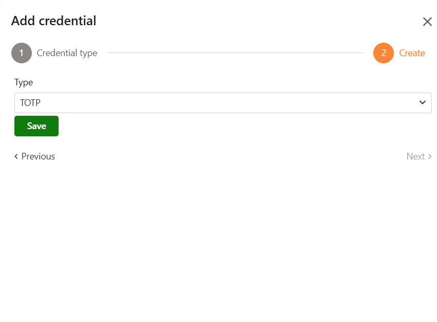
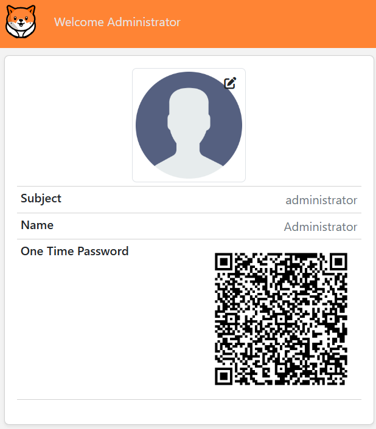
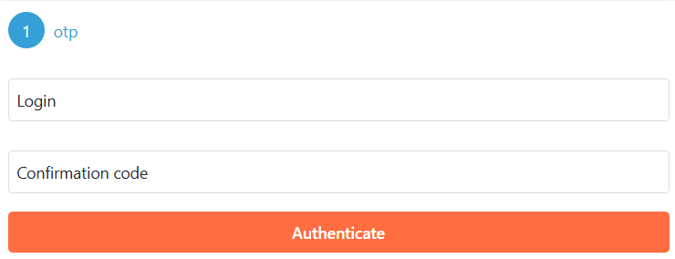

# One Time Password Authentication

This article explains how to configure one-time password (OTP) authentication on your identity server using the `SimpleIdServer.IdServer.Otp` NuGet package. 
OTPs are generated by mobile applications that support the Time-based One-Time Password (TOTP) algorithm, providing an extra layer of security during user authentication.

## Installation

To begin, install the SimpleIdServer.IdServer.Otp package on your identity server. Open your command line interface and execute the following command:

```bash  title="cmd.exe"
dotnet add package SimpleIdServer.IdServer.Otp
```

Unlike other SimpleIdServer authentication libraries, this package does not offer options to alter its behavior. Therefore, do not modify the `appsettings.json` configuration file for OTP authentication.

## Configuring the Identity Server

After installing the package, you must integrate OTP authentication by calling the `AddOtpAuthentication` function from the fluent API. 
This function registers all necessary dependencies for OTP-based authentication. Below is a C# code snippet that demonstrates how to set up your identity server with OTP authentication:

```csharp  title="Program.cs"
webApplicationBuilder.Configuration.AddJsonFile("appsettings.json")
    .AddJsonFile($"appsettings.{webApplicationBuilder.Environment.EnvironmentName}.json", optional: true)
    .AddEnvironmentVariables();
webApplicationBuilder.AddSidIdentityServer()
    .AddDeveloperSigningCredential()
    .AddInMemoryUsers(Config.Users)
    .AddInMemoryLanguages(Config.Languages)
    .AddOtpAuthentication(true);
var app = webApplicationBuilder.Build();
app.Services.SeedData();
app.UseSid();
app.Run();
```

Note that, unlike other authentication libraries (such as those for SMS or email), the private key used to generate OTP codes is not stored in the package's configuration (specifically in the OTPValue property of appsettings.json). Instead, the private key is stored in the credentials of the logged-in user.

## Generating a Private OTP Key for a User

To enable OTP authentication for a specific user, follow these steps:

1. **Access the Administration Site**: Log in to the administration area of your identity server.
2. **Select the User**: Navigate to the list of users and choose the user for whom you want to generate an OTP private key.


3. **Add a Credential**: Go to the Credentials tab and click on the Add credential button.


4. **Choose OTP Credential**: In the pop-up window that appears, select `One Time Password` and click `Next`. Then choose the OTP algorithm type. `TOTP` is commonly supported by mobile applications, so it is generally the preferred choice. Finally, click `Save`.



After completing these steps, the OTP private key is associated with the user.

## User Authentication with OTP

Once the OTP credential is generated, the user can navigate to the identity server and log into their profile. During the authentication process, the user will see a QR code on the profile page. This QR code can be scanned by any mobile application that supports OTP generation, such as the [Microsoft Authenticator](https://www.microsoft.com/fr-be/security/mobile-authenticator-app).



Finally, when authenticating, the user must enter their login in the first field and the OTP code generated by the mobile application in the second field.


