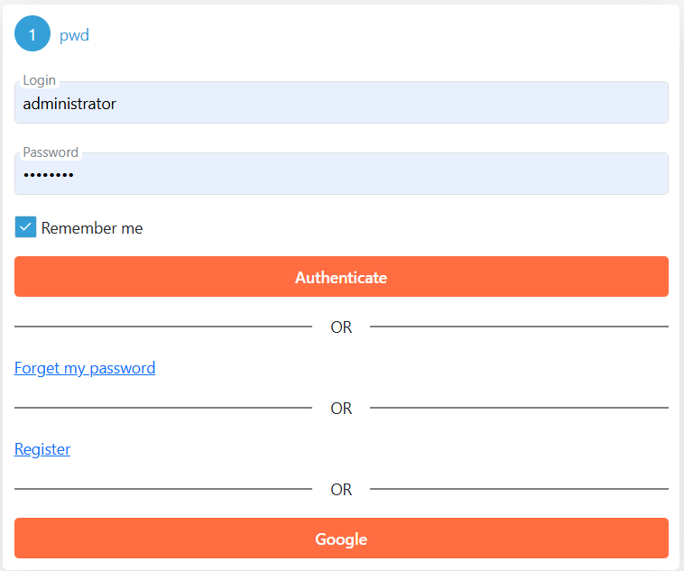

# Identity Providers

External identity providers such as Google or Facebook can be easily integrated into your identity server. By default, a list of these providers is displayed on the login page alongside the traditional username and password authentication, giving users more flexible ways to sign in.

In this article, we’ll walk you through the process of adding Google authentication as an external identity provider. The procedure is similar for other providers—adjusting the handler and options class as needed.

## 1. Adding the Google Authentication NuGet Package

The first step is to include the necessary package in your solution. Microsoft provides a NuGet package that adds Google authentication support:

```bash  title="cmd.exe"
dotnet add package Microsoft.AspNetCore.Authentication.Google
```

This package provides the foundational logic for authenticating users with Google.

## 2. Creating the Custom Options Class

To make the Google authentication provider configurable via your administration site, you need to create a custom options class. This class, named `GoogleOptionsLite`, implements the interface `IDynamicAuthenticationOptions<GoogleOptions>`. It contains properties that are editable in the administration panel through the use of the `ConfigurationRecordAttribute`.

The `ConfigurationRecordAttribute` is a key part of this configuration. It not only marks a property as editable but also provides metadata for its display and validation. Here are the properties of the attribute:

| Property | Description |
| -------- | ----------- |
| DisplayName | The display name of the property. |
| Description | A description providing more context about the property. |
| Order | The order in which the property appears in the administration interface. |
| IsRequired | Indicates whether the property is mandatory. |
| CustomType | For native types (such as string, boolean, int, etc.), if the property is not associated with one of the predefined enumeration values, this should be set to null. Otherwise, assign one of these values: `OTPVALUE`, `PASSWORD`, `NOTIFICATIONMODE`.  |
| DisplayCondition | An expression that the administration site evaluates to determine whether the field should be displayed. For example, the expression `AuthenticationType=CLIENT_SECRET_POST` means the property is shown only if `AuthenticationType` equals `CLIENT_SECRET_POST`. |

Below is the C# code for GoogleOptionsLite:

```csharp  title="GoogleOptionsLite.cs"
public class GoogleOptionsLite : IDynamicAuthenticationOptions<GoogleOptions>
{
    [SimpleIdServer.Configuration.ConfigurationRecord("ClientId", "Client identifier", 0, IsRequired = true)]
    public string ClientId { get; set; }
    [SimpleIdServer.Configuration.ConfigurationRecord("ClientSecret", "Client secret", 1, null, SimpleIdServer.Configuration.CustomConfigurationRecordType.PASSWORD, IsRequired = true)]
    public string ClientSecret { get; set; }

    public GoogleOptions Convert() => new GoogleOptions
    {
        ClientId = ClientId,
        ClientSecret = ClientSecret
    };
}
```

This class allows the administration interface to display and manage the required properties for Google authentication. Notice how the `ConfigurationRecordAttribute` is used to define metadata for each property.

## 3. Defining the Authentication Scheme

After setting up the custom options class, the next step is to create a definition for the new external identity provider. This is done using a builder pattern, where you define key parameters such as the authentication scheme name, display name, and the associated handler and options classes.

```csharp
AuthenticationSchemeProviderDefinition Google = AuthenticationSchemeProviderDefinitionBuilder
    .Create("google", "Google", typeof(GoogleHandler), typeof(GoogleOptionsLite))
    .Build();
```

Here, `typeof(GoogleHandler)` refers to the class that implements the logic required to authenticate users via Google. If you are integrating another provider, you would replace `GoogleHandler` and `GoogleOptionsLite` with the corresponding classes from your chosen library.

## 4. Creating and Registering the Provider Instance

Once the definition is created, you can instantiate the authentication provider:

```csharp
AuthenticationSchemeProviderBuilder
    .Create(Google, "Google", "Google", "Google")
    .Build();
```

The final step is to register both the definition and the instance in your application. This is typically done within the program.cs file by calling the `AddInMemoryAuthenticationSchemes` method, along with other necessary configuration settings.

Below is an example of how the registration might look:

```csharp  title="Program.cs"
webApplicationBuilder.Configuration.AddJsonFile("appsettings.json")
    .AddJsonFile($"appsettings.{webApplicationBuilder.Environment.EnvironmentName}.json", optional: true)
    .AddEnvironmentVariables();
webApplicationBuilder.AddSidIdentityServer()
    .AddDeveloperSigningCredential()
    .AddInMemoryUsers(Config.Users)
    .AddInMemoryLanguages(Config.Languages)
    .AddInMemoryAuthenticationSchemes(Config.AuthenticationSchemes, Config.AuthenticationSchemeDefinitions)
    .AddPwdAuthentication(true);

var app = webApplicationBuilder.Build();
app.Services.SeedData();
app.UseSid();
app.Run();
```

Once configured, the external providers will be displayed on the login page, offering a seamless and flexible authentication experience.

"

## 5. Configuring the Google Instance

To configure the properties of the `Google` instance, edit the configuration file and add the `Google` property, which must correspond to the instance name.
Within this property, you can include the properties of the GoogleOptionsLite class.
Here is an example configuration:

```json  title="appsettings.json"
"Google": {
  "GoogleOptionsLite": {
    "ClientId": "357608317425-bf8pibt1s4t2b4dkr12ar70rc6o78j4l.apps.googleusercontent.com",
    "ClientSecret": "5majI7of9JK_yGqERP-C3Sm9"
  }
}
```

For more detailed reference, you can check out the example project available on GitHub: [SimpleIdServer Sample](https://github.com/simpleidserver/SimpleIdServer/tree/master/samples/IdserverIdproviders).