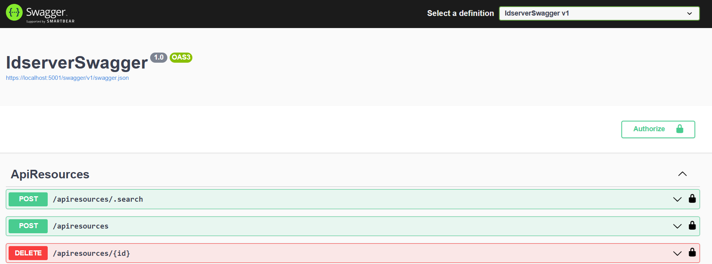

# Enabling Swagger

Swagger is an open-source framework that facilitates designing, building, documenting, and consuming RESTful APIs. It provides a user-friendly interface that allows developers not only to view API endpoints but also to interact with them directly. This interactive documentation greatly enhances both development and testing processes, ensuring that APIs remain well-documented and easily accessible.

## Enabling Swagger on the Identity Server

To enable Swagger on your identity server, you must first install the NuGet package `SimpleIdServer.IdServer.Swagger`. 
It is crucial that the identity server is configured to authenticate users—typically via a login and password—because without this, Swagger will be unable to acquire the necessary access token to secure API endpoints.

```bash  title="cmd.exe"
dotnet add package SimpleIdServer.IdServer.Swagger
```

## Configuring Swagger Dependencies

After installing the package, the next step is to edit the `Program.cs` file. 
In this file, you need to call the `AddSwagger` function from the fluent API. 
This function registers the dependencies for Swagger and takes a parameter used to extract comments from a DLL, which helps document the entities exposed by the Swagger endpoint, such as REST API parameters and operations.

Below is an example of how to integrate Swagger in C#:

```csharp
AddSwagger(opt =>
{
    opt.IncludeDocumentation<AccessTokenTypeService>();
});
```

## Setting Up XML Documentation Files

If the XML files required for documentation are not present in the build output directory, you must update your csproj file. Adding the following target ensures that the XML documentation files are copied to the output directory during the build process:

```xml
<Target Name="CopyReferenceFiles" BeforeTargets="Build">
	<ItemGroup>
		<XmlReferenceFiles Condition="Exists('$(OutputPath)%(Filename).dll')" Include="%(Reference.RelativeDir)%(Reference.Filename).xml" />
	</ItemGroup>
	<Message Text="Copying reference files to $(OutputPath)" Importance="High" />
	<Copy SourceFiles="@(XmlReferenceFiles)" DestinationFolder="$(OutputPath)" Condition="Exists('%(RootDir)%(Directory)%(Filename)%(Extension)')" />
</Target>
```

## Seeding the Swagger Client

Since all operations are protected by an access token, it is necessary to configure a client that can access these endpoints. 
The fluent API provides the `SeedSwagger` function, which sets up a client with permissions for all scopes and operations. By default, this client uses the following credentials:

* **Client identifier** : swaggerClient
* **Client Secret** : password

You can seed the Swagger client with the following C# code:

```csharp
SeedSwagger(new List<string> { "https://localhost:5001/swagger/oauth2-redirect.html" });
```

## Displaying the Swagger UI

To display the Swagger graphical interface, your application must call the actions `UseSidSwagger` and `UseSidSwaggerUi`. 
These methods are typically invoked after building the application, as shown in the following example:

```csharp
var app = builder.Build();
app.Services.SeedData();
app.UseSid();
app.UseSidSwagger();
app.UseSidSwaggerUi();
```

## Complete Configuration Example

Here is a complete example of configuring the identity server with Swagger support in C#:

```csharp  title="Program.cs"
var users = new List<User>
{
    UserBuilder.Create("administrator", "password", "Administrator")
               .SetEmail("adm@mail.com")
               .SetFirstname("Administrator")
               .Build()
};

builder.AddSidIdentityServer(o =>
    {
        o.Authority = "https://localhost:5001";
    })
    .AddDeveloperSigningCredential()
    .AddInMemoryUsers(users)
    .AddPwdAuthentication(true)
    .AddSwagger(opt =>
    {
        opt.IncludeDocumentation<AccessTokenTypeService>();
    })
    .SeedSwagger(new List<string> { "https://localhost:5001/swagger/oauth2-redirect.html" });

var app = builder.Build();
app.Services.SeedData();
app.UseSid();
app.UseSidSwagger();
app.UseSidSwaggerUi();
app.Run();
```

## Accessing the Swagger Interface

Once your application is configured and running, you can access the Swagger graphical interface via the following URL: https://URL/swagger

This configuration not only enables comprehensive documentation for your REST APIs but also ensures a secure and interactive way to test and explore your API endpoints.



For more detailed reference, you can check out the example project available on GitHub: [SimpleIdServer Sample](https://github.com/simpleidserver/SimpleIdServer/tree/master/samples/IdserverSwagger).