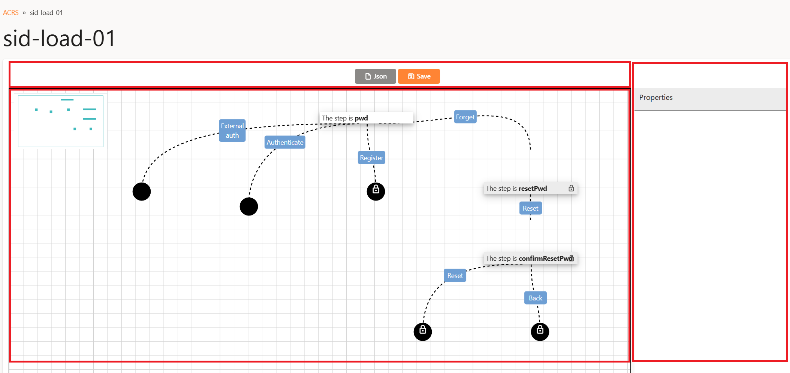
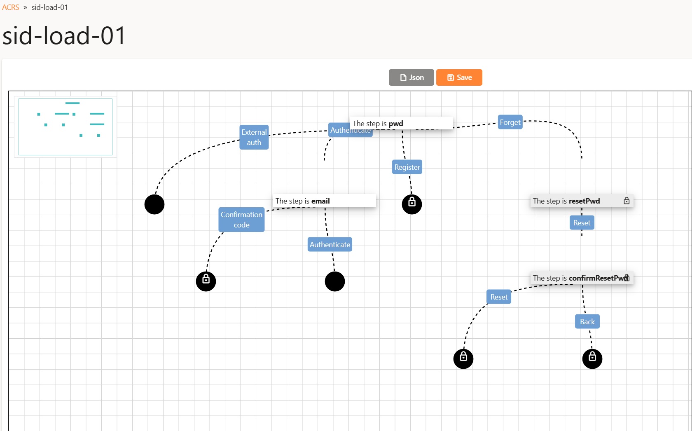
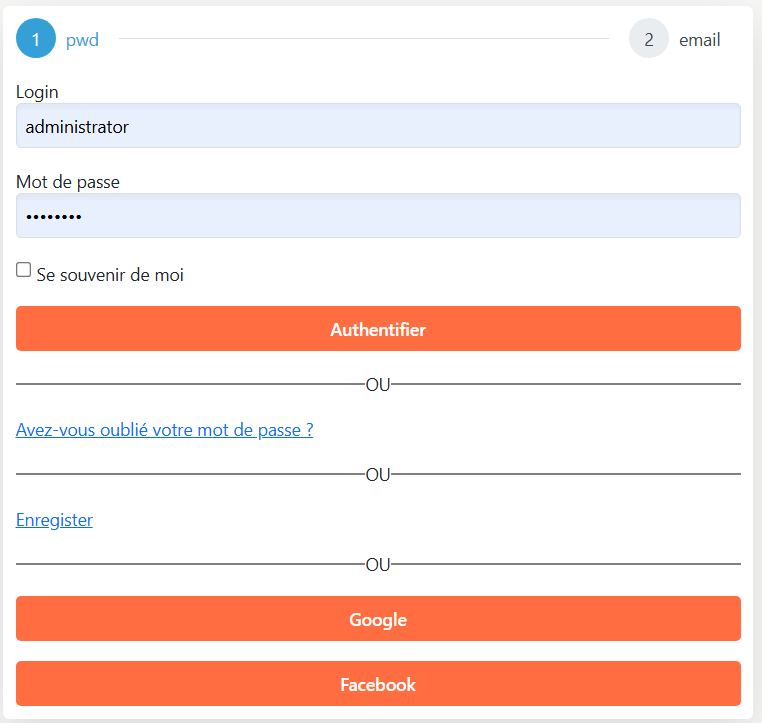

# ACR (Authentication Context Class Reference)

In OpenID Connect, the Authentication Context Class Reference (ACR) is a way for a client to request that the identity provider perform a specific level or method of authentication—for example, requiring multi‑factor authentication (MFA) or higher assurance steps. You'd include an `acr_values` parameter in your authentication request whenever your application needs to enforce particular security requirements (e.g., "password + email OTP") or to comply with regulatory standards (e.g., eIDAS LoA2 in Europe). By leveraging ACR, clients can dynamically signal which authentication flows or assurance levels are acceptable, and the identity server can respond with the actual method(s) used.

SimpleIdServer provides a dedicated UI for administering all your authentication flows. Here’s how to find and customize them:

1. **Navigate to the Administration Portal** : Open your browser, go to the SimpleIdServer admin site, and click Authentication → Authentication Context in the left menu.
2. **Locate the Default Flow** : By default, SimpleIdServer uses the process named `sid-load-01`. If no other flow matches an incoming request's ACR requirements, the server will fall back to `sid-load-01`.
3. **Open the Editor** : Click on `sid-load-01` to bring up the flow editor, which is divided into three panels:

    1. Top Bar with two actions :

      * **JSON**: view/edit the current flow as raw JSON.
      * **Save** : persist any changes to the flow.

    2. **Central Canvas**: a drag‑and‑drop editor where you compose authentication steps.
    3. **Right‑Hand Panel**: shows properties for the selected node or connection.

## Understanding the Flow Elements

An authentication flow consists of four node types:

* **Authentication Node**
  * Used to perform user authentication (e.g., login/password).
  * Editable (no lock icon).

* **Intermediate Node**
  * System‑inserted helpers (gray‑out + lock icon), for workflows like “Reset Password” that extend a basic authentication step.

* **End Node (Editable)**
  * Represents a terminal authentication method; you can change the method (e.g., switch from `password` to `email` OTP).

* **End Node (Non‑Editable)**
  * A locked terminal step that cannot be altered or extended.

By default, `sid-load-01` contains a simple login + password flow.

## Adding 2FA (e.g., Login/Password + Email OTP)

To extend sid-load-01 with a second factor:

1. **Edit the Password End Node**
   * Click the edit icon on the end node following the Authenticate link from the “pwd” node.
   * In the right panel, select email from the dropdown.

2. **Chain to an OTP End Node**
   * Next, click the edit icon on the end node that now follows the Authenticate link from the email node.
   * Choose End step (the final OTP check).

Your flow should now look like this:

3. **Save Your Changes**
   * Click `Save` in the top bar.

4. **Test the New Flow**
   * Log out and back in to the admin portal.

