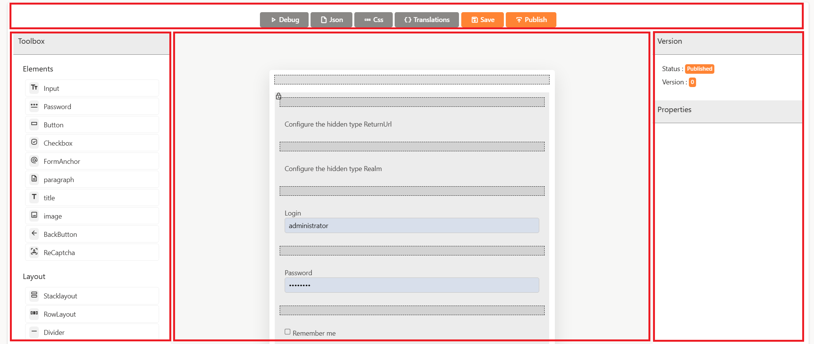
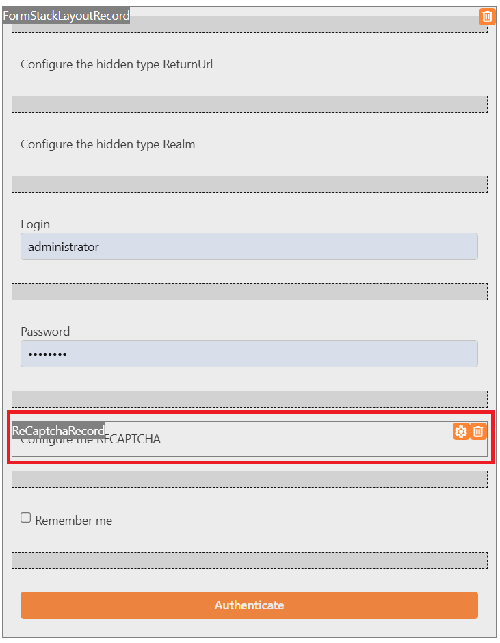

# Customizing Authentication Forms

SimpleIdServer’s authentication modules ship with fully editable user‑interface templates. 
Whether you’re using the built‑in password module, email‑based flows, or any other NuGet package, you can tailor every aspect of the login, registration, or verification forms directly in the Admin UI. 
This article walks you through accessing the form designer and explains each of its major components.

## Accessing the Form Designer

1. Log in to the SimpleIdServer Administration platform.
2. Navigate to **Authentication Contexts (ACRs)** in the left‑hand menu.
3. Select the **Forms** tab at the top of the page.


Click on the form you wish to customize—e.g. the **Password** form for the `SimpleIdServer.IdServer.Pwd` package.

## UI Overview

Once you open a form, the editor appears with four distinct panels:

| Panel | Purpose |
| ----- | ------- |
| Toolbox | Drag‑and‑drop components (titles, paragraphs, images, etc.) onto your form canvas.
| Actions |	Tools for inspecting JSON, editing CSS, saving, publishing, or debugging your form. |
| Properties |	Edit the selected component’s settings: CSS classes, JSON parameters, translations, scripts. |
| Preview |	Live rendering of your form—add, remove, move components, and see translation edits in real‑time. |



## Toolbox Components

While the toolbox offers many raw inputs (e.g. Input, Password), only a few are fully customizable:

* **Paragraph** : Insert descriptive or instructional text. All translations can be managed via the Properties panel.
* **Title** : Add section headers with adjustable heading levels (e.g. H1, H2) and full translation support.
* **Image**: Display logos or graphics by URL. You can swap out the source or add alt‑text for accessibility. 

:::tip

Locked elements (e.g. the core login and password fields) will appear greyed out with a lock icon—they cannot be removed but their translations are still editable.

:::

## Actions Panel

Five buttons at the top of the editor give you powerful control:

* **Debug** : Enter arbitrary JSON to simulate different authentication inputs; elements with conditional visibility will toggle on/off accordingly.
* **JSON** : Switch the Properties panel to show the raw JSON model of your form, so you can tweak element properties, add conditions, or define data‑binding rules.
* **CSS** : Edit the template’s CSS. Choose among installed libraries (Radzen by default, or install Tailwind CSS) and override classes, scripts, or external files.
* **Translations** : Edit the translations of the success and error messages in all languages supported by the Identity Server.
* **Save** : Persist your edits to the draft version of this form.
* **Publish** : Push all saved changes live. Only published forms will be served to end users at runtime.

## Preview Panel

The Preview shows exactly how users will experience the form. Key points:

* **Locked elements** : Core authentication fields (e.g. "Login" and "Password") have a padlock icon—these are necessary for protocol compliance and cannot be removed.
* **Hover Icons** : Move your mouse over any component to reveal:

   1. Edit Properties (pencil icon).
   2. Delete element (trash icon).


## Properties Panel Deep Dive

### Editing Form JSON

Click **JSON** in the Actions panel to reveal the form's JSON schema:

```json
{
    "Id": "a415938e-26e1-4065-ac7f-bc583f36b123",
    "Name": "pwd",
    "Category": "auth",
    "Elements": [
        {
            "$type": "StackLayout"
        }
        ...
    ]
}
```

You can:

* Add or remove translation keys
* Define conditional visibility:

```json
{
    "Elements": [
        {
            "Transformations": [
                {                    
                    "$type": "PropertyTransformationRule",
                    "PropertyName": "IsNotVisible",
                    "PropertyValue": "true",
                    "Condition": {
                        "$type": "ComparisonParameter",
                        "Source": "$.CanResetPassword",
                        "Value": "false",
                        "Operator": 1,
                        "Type": "Comparison"
                    },
                    "Type": "PropertyTransRule"
                }
            ]
        }
    ]
}
```

### Editing the CSS Template

Click **CSS** in the Actions panel to reveal the form's CSS Template:

1. **CSS classes** : Assign or override class names on each element type (e.g. form-title, submit-button).
2. **Javascript files**: Include external scripts or inline custom functions for advanced interactivity.
3. **CSS files** : Link external stylesheets or write inline CSS rules.

Any change you make will instantly refresh the Preview. Remember: saving CSS changes affects all forms in the current realm, so coordinate updates carefully!

### Editing the translations

Click **Translations** in the Actions panel to view the available translations. 
Use the Success messages and Error messages tabs to edit the corresponding translations.

## Adding Captcha

In authentication or registration forms, it is possible to add a "Captcha" to verify whether the user is a human and not a bot.
To add one, navigate to the graphical editor of a form and drag the component into the form.

Currently, only the reCAPTCHA2 type is supported. You can create one at the following URL: https://www.google.com/recaptcha/admin/create.

Once the Captcha is created, you will need to retrieve the `site key` and the `secret key` to configure the Captcha component.



In the properties of the Captcha component, enter the `site key`, then save and publish the form changes.

Here is what the Login and Password authentication form will look like when the Captcha is properly configured:


When a form containing the Captcha is submitted by the user, the `CaptchaValue` element is sent to the backend along with the Captcha value.

This value must be validated by your identity server in the backend.

To enable this validation, edit the `Program.cs` file and call the `EnableV2Recaptcha` method. You must pass the `secret key` as a parameter.

Here is an example configuration:

```csharp title="Program.cs"
webApplicationBuilder.AddSidIdentityServer()
    .EnableV2Recaptcha(c => {
        s.Secret = "<secret>";
    })
```
"